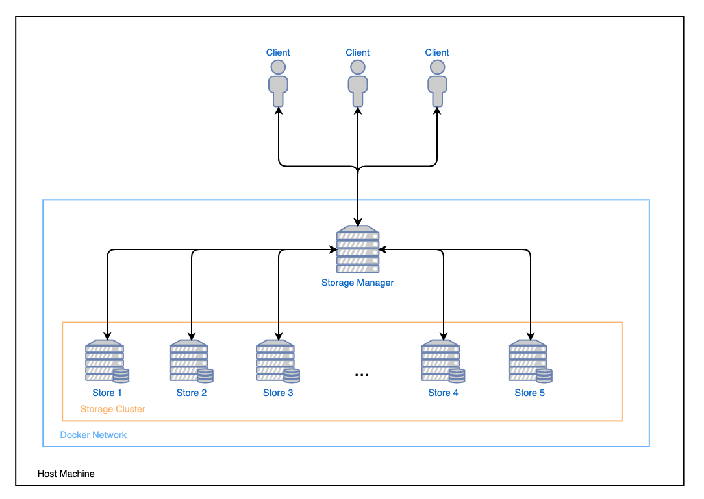

## Balanced Simple Store Service (BS3)
Balanced Simple Store Service (BS3) is a distributed system designed for the companies that cannot use cloud storage as the managed data is sensitive and need to store it internally. The system is balancing its volume of data across all storing machines.

### CLI
* `exit`
* `create <bucket>`
* `upload <local_file> <remote_file> <bucket>`
* `list <bucket>`
* `download <remote_file> <local_file> <bucket>`
* `remove <remote_file> <bucket>`
* `purge <bucket>`

### System Topology

